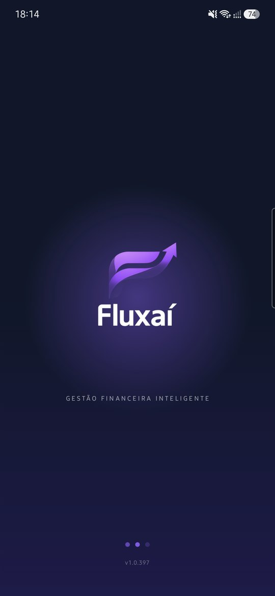
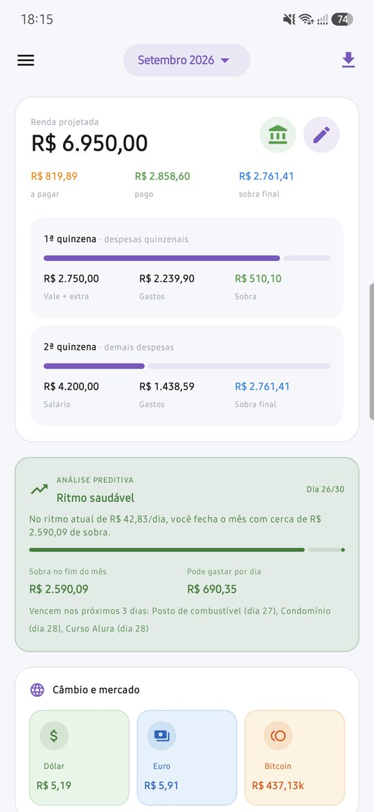
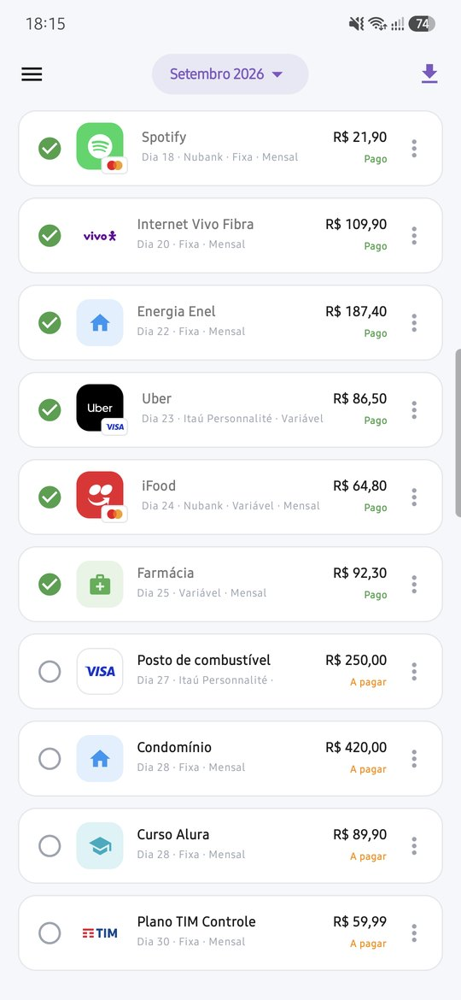
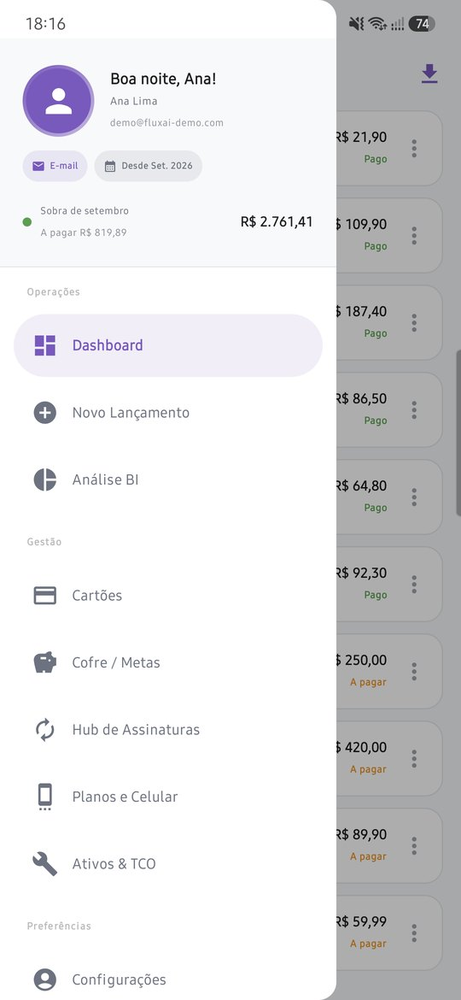
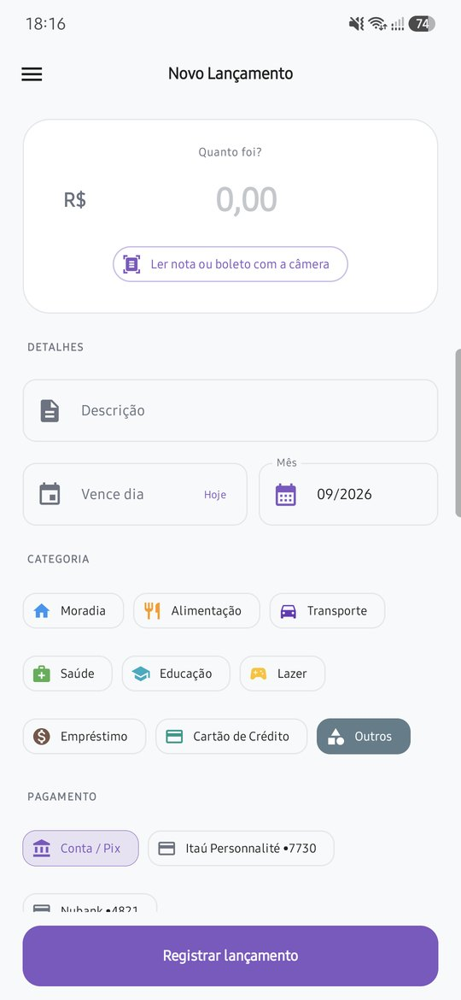
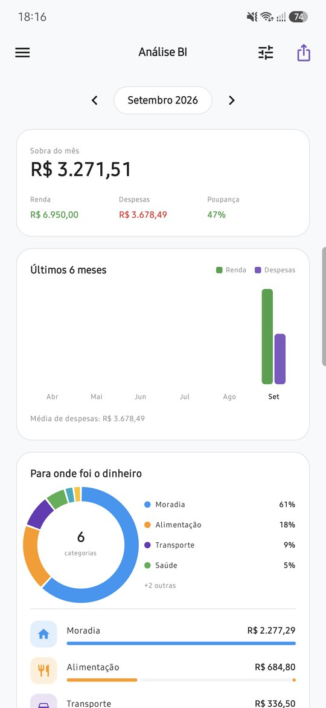
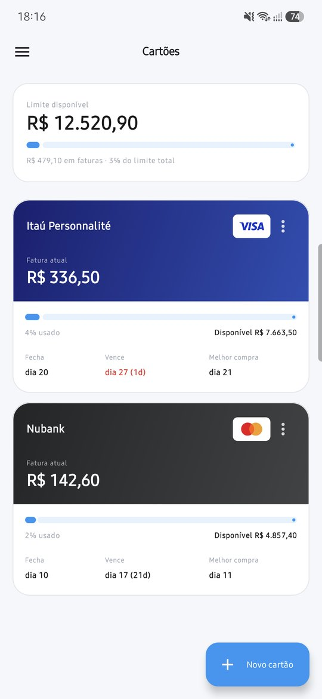
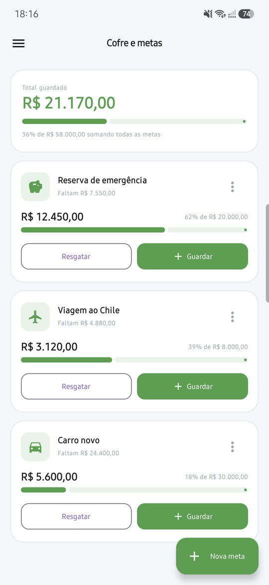
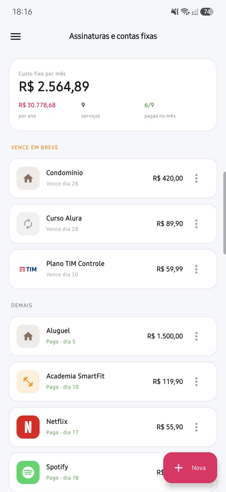

# 🚀 FluxAí - Gestão Financeira Inteligente


O **FluxAí** é um aplicativo Android nativo para controle financeiro pessoal e familiar. Além de registrar gastos, ele projeta como o mês vai terminar, avisa sobre vencimentos e tem um consultor de IA que analisa os números do mês e responde perguntas sobre eles.

## ✨ Funcionalidades

### Dia a dia
* **📊 Dashboard do mês:** renda projetada, quanto falta pagar, quanto já foi pago e a sobra final, separados por quinzena (vale/adiantamento e salário).
* **🔮 Análise preditiva:** calcula o ritmo diário de gastos, estima a sobra no fim do mês, mostra quanto dá para gastar por dia e em que dia a sobra zera.
* **➕ Novo lançamento:** valor em destaque, categorias com ícones, parcelamento, cartão ou conta, "já foi pago", **leitura de nota fiscal pela câmera** (OCR + IA) e **leitura do código de barras do boleto ou do Pix** (câmera ou Copia e Cola), que preenche valor e vencimento.
* **🧾 Comprovantes:** foto do recibo anexada ao lançamento (Firebase Storage).
* **📥 Importar extrato:** OFX ou CSV do banco (conta ou fatura do cartão), com revisão, detecção de duplicados e categorização automática ou por IA.
* **🔔 Compras pelas notificações do banco:** lê os avisos de apps de banco (Nubank, Inter, Itaú...) e sugere o lançamento para você confirmar.
* **🔁 Contas recorrentes:** sugere trazer as contas fixas e as adiadas do mês anterior.
* **⚡ Atalhos:** bloco "Lançar gasto" nas configurações rápidas, atalhos no ícone do app e botão no widget.
* **🏷️ Logos automáticos:** reconhece serviços pela descrição (Netflix, Spotify, Nubank, operadoras...) e mostra a bandeira do cartão usado na compra.
* **🔎 Busca, filtro por categoria e reordenação** dos lançamentos arrastando.

### Gestão
* **🏦 Contas bancárias:** saldo real de cada conta, entradas e transferências; lançamentos pagos descontam da conta escolhida.
* **💳 Cartões:** limite, fatura atual e pagamento de fatura (inclusive parcial, com o restante lançado no mês seguinte).
* **🔄 Hub de assinaturas:** custo fixo mensal e anual, contas que vencem em breve e atrasadas.
* **📈 Investimentos:** carteira de renda fixa (CDI, Selic, prefixado, IPCA+, poupança, com IR estimado) e renda variável (ações, FIIs, ETFs e cripto com cotação do dia), patrimônio no Dashboard, quanto rendeu no mês e metas do Cofre ligadas a investimentos.
* **🐷 Cofre/Metas:** caixinhas com prazo opcional; o app calcula quanto guardar por mês e reserva esse valor na previsão.
* **📱 Planos e celular** e **🚗 Ativos & TCO** (custo total e manutenção de bens).
* **🏦 Empréstimos:** registra o valor recebido e gera as parcelas automaticamente.
* **📈 Análise BI:** composição de gastos, fixas vs. variáveis, limites por categoria, acerto de contas da conta conjunta e maiores gastos.
* **📅 Relatório anual:** renda x despesas mês a mês, comparação com o ano anterior e resumo de saúde e educação para o Imposto de Renda.

### Inteligência e avisos
* **🤖 Consultor IA:** diagnóstico do mês com ações concretas em R$, seguido de um chat para tirar dúvidas usando os mesmos dados.
* **🔔 Alertas de vencimento:** um aviso diário com as contas vencidas, de hoje e dos próximos dias, com botão "Já paguei"; aviso de contas que vencem em **feriado bancário** (Brasil API).
* **🎯 Orçamento por categoria:** alerta no Dashboard, na hora de lançar e por notificação ao passar de 80% e de 100% do limite.
* **⏰ Lembrete diário** opcional para registrar os gastos.
* **💱 Câmbio e mercado:** dólar, euro e bitcoin (AwesomeAPI).
* **🧩 Widget na tela inicial** com sobra do mês, limite diário e próximas contas.

### Conta e segurança
* **🔒 Login** com e-mail/senha ou Google (Credential Manager + Firebase Auth) e **desbloqueio por biometria** ou PIN do aparelho.
* **👨‍👩‍👧 Conta conjunta:** o dono gera um código de convite e a família compartilha o mesmo espaço financeiro; cada lançamento pago registra quem pagou.
* **👋 Apresentação inicial** (renda, conta, cartão e automações) e **dados de exemplo** para explorar o app.
* **💾 Backup completo** em JSON e restauração, além do aviso de **sem internet** com sincronização automática.
* **🎨 Tema claro/escuro** e cor de destaque personalizável.
* **📂 Exportação** do mês em `.csv` e aviso de nova versão do app.

## 🛠️ Tecnologias

* **Linguagem:** [Kotlin](https://kotlinlang.org/)
* **UI:** [Jetpack Compose](https://developer.android.com/jetpack/compose) com Material Design 3
* **Arquitetura:** Compose Navigation + ViewModels com `StateFlow`
* **Backend:** [Firebase](https://firebase.google.com/)
  * *Firestore* (dados em tempo real, protegidos por `firestore.rules`)
  * *Authentication* (e-mail/senha e Google)
  * *Cloud Functions* (proxy da IA e exclusão de conta) com *Secret Manager*
  * *Cloud Messaging* (notificações)
  * *Storage* (comprovantes, protegidos por `storage.rules`)
  * *Crashlytics* (relatório de falhas nas versões publicadas)
* **IA:** modelos via [Groq](https://groq.com/), chamados só pela Cloud Function `groqChat`, então **nenhuma chave de IA vai dentro do APK**
* **OCR e códigos:** ML Kit Text Recognition e Barcode Scanning
* **Segundo plano:** WorkManager (alertas de vencimento e manutenção)
* **Widget:** Jetpack Glance
* **Gráficos:** desenhados com o `Canvas` do Compose

## 📱 Telas do Aplicativo

> Prints feitos com uma conta de demonstração e dados fictícios.

| Splash | Login | Dashboard | Lançamentos | Menu |
|:---:|:---:|:---:|:---:|:---:|
|  |  |  |  |  |

| Novo lançamento | Análise BI | Cartões | Cofre / Metas | Assinaturas |
|:---:|:---:|:---:|:---:|:---:|
|  |  |  |  |  |

## ⚙️ Como rodar o projeto localmente

### Pré-requisitos
* Android Studio (versão recente) com JDK 17
* Conta no [Firebase Console](https://console.firebase.google.com/) no plano Blaze (necessário para Cloud Functions com secrets)
* Chave de API da [Groq](https://console.groq.com/)
* [Firebase CLI](https://firebase.google.com/docs/cli) e Node.js, para publicar as functions

### 1. Clone o repositório
```bash
git clone https://github.com/hsrodrigues/Fluxai.git
```

### 2. Configure o Firebase
* Crie um projeto no Firebase e adicione um app Android com o pacote `fluxai.app`.
* Baixe o `google-services.json` e coloque em `app/`.
* Ative a autenticação por e-mail/senha e Google, crie o banco Firestore e ative o Storage.
* Publique as regras do banco:
  ```bash
  firebase deploy --only firestore:rules,storage
  ```

### 3. Configure a IA (Cloud Function)
As chaves ficam no Secret Manager do Firebase, fora do app:
```bash
cd functions && npm install && cd ..
firebase functions:secrets:set GROQ_API_KEY_OCR
firebase functions:secrets:set GROQ_API_KEY_CONSULTOR
firebase deploy --only functions
```

> `google-services.json`, `local.properties` e keystores estão no `.gitignore` e nunca devem ir para o repositório.

### 4. Compile e rode
* No Android Studio, clique em **Sync Project with Gradle Files** e rode no emulador ou no aparelho.
* Pela linha de comando:
  ```bash
  ./gradlew installDebug          # versão de desenvolvimento
  ./gradlew assembleRelease       # versão final otimizada (R8) em app/build/outputs/apk/release/
  ./gradlew testDebugUnitTest     # testes unitários
  ```
* O número da versão é incrementado automaticamente a cada build (`app/version.properties`).

## 🚀 Publicando uma versão

1. Faça o commit das alterações.
2. Rode `.\publicar.ps1` — ele cria a tag `v1.0.N` e envia ao GitHub.
3. O GitHub Actions compila e assina o APK e guarda como artefato do build (sem Release público).
4. O script espera o build, baixa o artefato e publica no site [fluxai-adbdf.web.app](https://fluxai-adbdf.web.app) (Firebase Hosting, pasta `site/`) junto com o `versao.json`; o app consulta esse arquivo, avisa da nova versão e instala a atualização.

## 🔐 Acesso

* Todo cadastro novo fica **pendente** até o administrador (`hsrodrigues01@gmail.com`) ativar em **Menu → Usuários**.
* A trava vale no servidor: `firestore.rules`, `storage.rules` e as functions exigem `acesso/{uid}.ativo == true`.
* O APK é público na página de download, mas sem conta ativada o app não abre nada.

## 📄 Licença

Software proprietário. O código está visível apenas para consulta; cópia, modificação e redistribuição não são permitidas sem autorização. Veja [LICENSE](LICENSE).

Desenvolvido com 💜 e Jetpack Compose por [Hudson](https://github.com/hsrodrigues).
